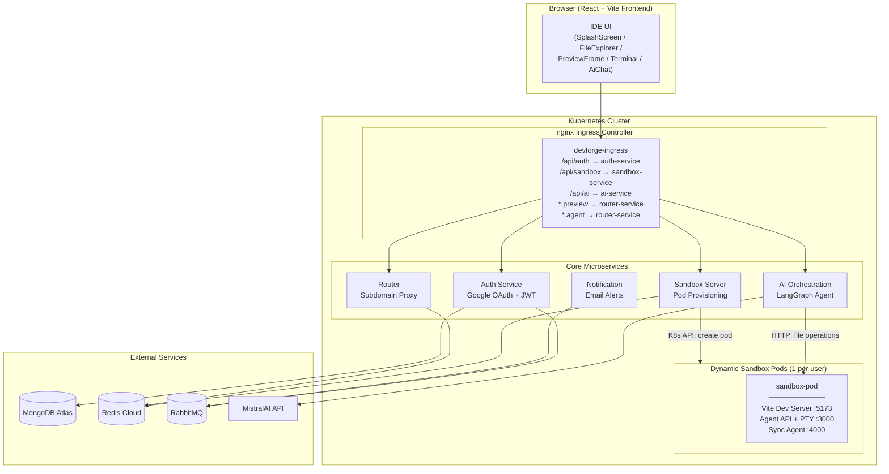
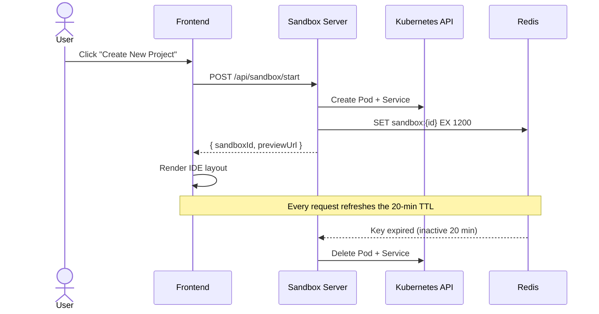

<h1 align="center">
  <br>
  ⚡ DevForge
  <br>
</h1>

<h4 align="center">AI-Powered Cloud IDE — Build React apps with natural language.</h4>

<p align="center">
  
  
  
  
  
  
  
  
  
  
  
</p>

<p align="center">
  <a href="#-features">Features</a> •
  <a href="#-architecture">Architecture</a> •
  <a href="#-tech-stack">Tech Stack</a> •
  <a href="#-project-structure">Project Structure</a> •
  <a href="#-how-it-works">How It Works</a> •
  <a href="#-getting-started">Getting Started</a> •
  <a href="#-environment-variables">Environment Variables</a> •
  <a href="#-deployment">Deployment</a>
</p>

---

## ✨ Features

| Feature | Description |
|---------|-------------|
| 🤖 **AI Code Agent** | Describe what you want in plain English — the LangGraph-powered Mistral agent reads, creates, and updates files in your sandbox in real time |
| 🖥️ **Browser-Based IDE** | VS Code–style UI with file explorer, code viewer, integrated terminal (xterm.js), and live preview — all in the browser |
| ⚡ **Instant Hot Reload** | File writes from the AI agent trigger Vite's HMR — changes appear instantly in the preview pane without a full reload |
| 🏗️ **Isolated Sandboxes** | Each user gets a dedicated Kubernetes pod with its own Vite dev server and file system — complete isolation |
| 🔐 **Google OAuth** | One-click login with Google, JWT-based session management, httpOnly secure cookies |
| 📧 **Login Notifications** | RabbitMQ-driven email alerts on every login via Gmail OAuth2 |
| ☁️ **File Persistence** | Optional S3-backed sync agent preserves project files across sandbox restarts |
| 🔄 **Auto-Cleanup** | Inactive sandboxes are automatically destroyed after 20 minutes via Redis TTL expiry events |

---

## 🏛️ Architecture



---

## 🛠️ Tech Stack

| Layer | Technologies |
|-------|-------------|
| **Frontend** | React 19, Vite 8, Tailwind CSS v4, xterm.js, Socket.IO Client |
| **Backend** | Node.js 20, Express 5 (×5 microservices) |
| **AI** | LangChain + LangGraph (ReAct agent), Mistral Large, Zod schemas |
| **Infrastructure** | Kubernetes, Docker, Skaffold, nginx Ingress, RBAC |
| **Data** | MongoDB Atlas, Redis (TTL lifecycle), RabbitMQ (event queue) |
| **Auth** | Google OAuth 2.0, Passport.js, JWT (httpOnly cookies) |
| **DevOps** | GitHub Actions CI, multi-service Docker builds |
| **File Sync** | AWS S3 + Chokidar (optional persistence sidecar) |

---

## 📁 Project Structure

```
devforge/
├── frontend/                  # React IDE client
│   └── src/components/        # SplashScreen, TopBar, FileExplorer, PreviewFrame,
│                              # FileViewer, Terminal, AiChat
│
├── ai-orchestration/          # LangGraph AI agent service
│   └── src/agents/            # code.agent.js (system prompt + agent config)
│       └── tools.js           # list_files, read_files, update_files
│
├── auth/                      # Google OAuth + JWT auth service
│   └── src/
│       ├── config/            # MongoDB, RabbitMQ connections
│       ├── models/            # User schema
│       └── routes/            # OAuth flow + callback
│
├── notification/              # RabbitMQ consumer → Gmail notifications
│   └── src/
│       ├── email.js           # Nodemailer + Gmail OAuth2
│       └── mq.js              # Queue consumer
│
├── sandbox/
│   ├── server/                # Sandbox provisioning service
│   │   └── src/
│   │       ├── kubernetes/    # Pod & Service creation via @kubernetes/client-node
│   │       ├── config/        # Redis TTL + expiry listener
│   │       └── routes/        # /start, /project CRUD
│   │
│   ├── router/                # Subdomain-based reverse proxy
│   │   └── src/               # HTTP + WebSocket proxying with httpxy
│   │
│   ├── agent/                 # Per-sandbox sidecar (file API + PTY terminal)
│   │   └── src/app.js         # REST endpoints + Socket.IO terminal
│   │
│   ├── template/              # React+Vite starter template (init container)
│   │
│   └── sync-agent/            # S3 file persistence (optional sidecar)
│
├── k8s/                       # Kubernetes manifests
│   ├── *-deployment.yml       # Deployments for all services
│   ├── *-service.yml          # ClusterIP services
│   ├── ingress.yml            # nginx Ingress with wildcard subdomains
│   ├── rbac.yml               # ServiceAccount + Role for pod management
│   └── secrets.yml.example    # Template for K8s secrets
│
├── .github/workflows/ci.yml  # GitHub Actions CI pipeline
├── skaffold.yml               # Local dev (minikube)
├── skaffold-eks.yaml          # Production (AWS EKS)
├── .env.example               # Environment variable reference
└── PROJECT.md                 # Detailed engineering documentation (1200+ lines)
```

---

## 🔄 How It Works

### Sandbox Lifecycle



### AI Code Editing Flow

1. **User sends a message** → `POST /api/ai/invoke` (SSE stream)
2. **LangGraph agent** calls `list_files` → `read_files` → reasons → `update_files`
3. **Files land on shared emptyDir volume** → Vite detects changes → HMR update
4. **Preview iframe updates instantly** — no reload needed
5. **Agent streams activity log** + final response back to the chat UI

---

## 🚀 Getting Started

### Prerequisites

| Tool | Version | Purpose |
|------|---------|---------|
| Node.js | 20+ | All services and frontend |
| Docker | 24+ | Container builds |
| kubectl | 1.28+ | Cluster management |
| minikube | 1.32+ | Local Kubernetes cluster |
| Skaffold | v2+ | Build + deploy orchestration |

### Local Setup

```bash
# 1. Clone the repo
git clone <repo-url>
cd devforge

# 2. Start minikube
minikube start --driver=docker --cpus=4 --memory=8g

# 3. Enable nginx Ingress
minikube addons enable ingress

# 4. Point Docker to minikube's registry
eval $(minikube docker-env)

# 5. Create secrets from template
cp k8s/secrets.yml.example k8s/secrets.yml
# Edit k8s/secrets.yml with your real credentials
kubectl apply -f k8s/secrets.yml

# 6. Apply RBAC
kubectl apply -f k8s/rbac.yml

# 7. Start all services
skaffold dev

# 8. In a new terminal — start the frontend
cd frontend
npm install
npm run dev
# → http://localhost:5173
```

### Wildcard DNS (for sandbox previews)

Sandbox previews use subdomains like `{id}.preview.localhost`. Configure DNS:

```bash
# Get minikube IP
minikube ip  # e.g., 192.168.49.2

# macOS — use dnsmasq
brew install dnsmasq
echo "address=/.localhost/$(minikube ip)" >> /opt/homebrew/etc/dnsmasq.conf
sudo brew services start dnsmasq
```

---

## 🔐 Environment Variables

See [`.env.example`](.env.example) for the complete reference. Summary:

| Variable | Service | Source |
|----------|---------|--------|
| `AUTH_MONGO_URI` | Auth | MongoDB Atlas |
| `GOOGLE_CLIENT_ID` | Auth, Notification | Google Cloud Console |
| `GOOGLE_CLIENT_SECRET` | Auth, Notification | Google Cloud Console |
| `JWT_SECRET` | Auth, Sandbox | Generate random hex |
| `RABBITMQ_URL` | Auth, Notification | CloudAMQP |
| `MONGO_URI` | Sandbox Server | MongoDB Atlas |
| `REDIS_URL` | Sandbox Server, Router | Redis Cloud |
| `MISTRALAI_API_KEY` | AI Orchestration | console.mistral.ai |
| `EMAIL_USER` | Notification | Gmail address |
| `GOOGLE_REFRESH_TOKEN` | Notification | Google OAuth playground |
| `TEMPLATE_IMAGE` | Sandbox Server | Docker image name |
| `AGENT_IMAGE` | Sandbox Server | Docker image name |
| `SYNC_AGENT_IMAGE` | Sandbox Server | Docker image name |
| `AWS_*` | Sync Agent | AWS IAM (optional) |

---

## 🌐 Deployment

### AWS EKS (Production)

The project includes a separate Skaffold config for EKS:

```bash
# Authenticate with ECR
aws ecr get-login-password --region ap-southeast-1 | docker login --username AWS --password-stdin <account-id>.dkr.ecr.ap-southeast-1.amazonaws.com

# Deploy
skaffold run -f skaffold-eks.yaml
```

### CI/CD

GitHub Actions runs automatically on push to `main`:
- **Lint & build** the React frontend
- **Build all 8 Docker images** to verify Dockerfiles are valid

See [`.github/workflows/ci.yml`](.github/workflows/ci.yml).

---

## 📄 Documentation

For deep engineering documentation (1200+ lines), see [`PROJECT.md`](PROJECT.md) which covers:
- Complete API reference for all services
- Data models & MongoDB schemas
- Kubernetes cluster design & RBAC
- AI agent architecture & tool implementations
- Sandbox lifecycle with sequence diagrams
- Security considerations
- Known limitations & roadmap

---

## 📝 License

ISC
